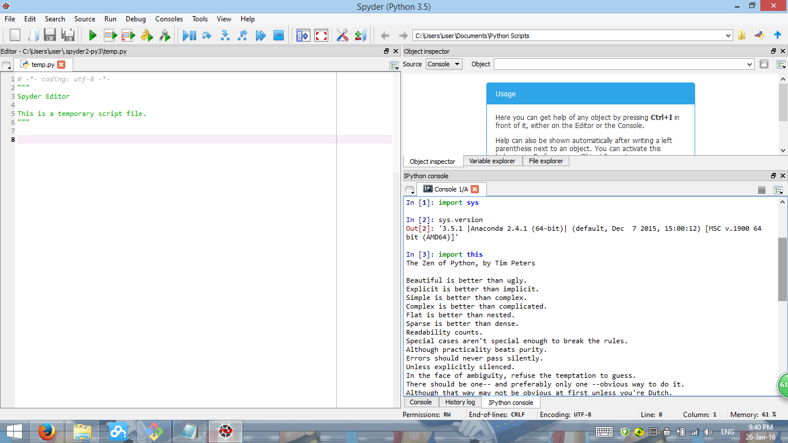

UECM3033 Assignment #1 Report
========================================================

- Prepared by: Ng Wan Ping
- Tutorial Group: T2

--------------------------------------------------------

## Task 1 -- setup a github repository

The reports, codes and supporting documents are uploaded to Github at: 

[https://github.com/ngwanping/UECM3033_assign1](https://github.com/ngwanping/UECM3033_assign1)

---------------------------------------------------------

## Task 2 -- setup python

Put here the screen shot of file (python.png)

------------------------------------------------------------

## Task 3 -- modify and run Python script

In this section, please report:

1. The hexadecimal value of your student ID.

   Hexadecimal representation of 1303444 is 0x13e394

2. Write down the definite integrals that you have chosen.
   
   $$\int_0^{\infty} x^6*e^{-x^2} dx = \frac{15*\sqrt{\pi}}{2}.$$

3. Write down your system of 10 linear equations.

\begin{align*}
2 x_0 +3 x_1 +5 x_2+6 x_3+  x_4 + 0 x_5 +2 x_6+  x_7+ 3 x_8 +4 x_9 &= 10,\\
  x_0 +6 x_1 +3 x_2+2 x_3+3 x_4 +   x_5 +0 x_6+6 x_7+ 7 x_8 +2 x_9 &= 12,\\
5 x_0 +  x_1 +2 x_2+3 x_3+6 x_4 + 2 x_5 +2 x_6+  x_7+ 6 x_8 +8 x_9 &= 10,\\
2 x_0 +5 x_1 +  x_2+  x_3+0 x_4 + 3 x_5 +2 x_6+  x_7+ 3 x_8 +2 x_9 &= 10,\\
  x_0 +4 x_1 +0 x_2+2 x_3+0 x_4 + 4 x_5 +  x_6+3 x_7+ 4 x_8 +6 x_9 &= 10,\\
  x_0 +3 x_1 +7 x_2+4 x_3+3 x_4 + 2 x_5 +0 x_6+  x_7+   x_8 +0 x_9 &= 10,\\
7 x_0 +2 x_1 +4 x_2+5 x_3+7 x_4 +   x_5 +0 x_6+3 x_7+   x_8 +2 x_9 &= 10,\\
6 x_0 +  x_1 +  x_2+2 x_3+2 x_4 + 7 x_5 +0 x_6+  x_7+ 3 x_8 +3 x_9 &= 10,\\
3 x_0 +2 x_1 +2 x_2+4 x_3+5 x_4 +   x_5 +0 x_6+6 x_7+ 3 x_8 +  x_9 &= 10,\\
  x_0 +2 x_1 +3 x_2+0 x_3+3 x_4 + 2 x_5 +5 x_6+  x_7+ 0 x_8 +8 x_9 &= 10,\\
\end{align*}

